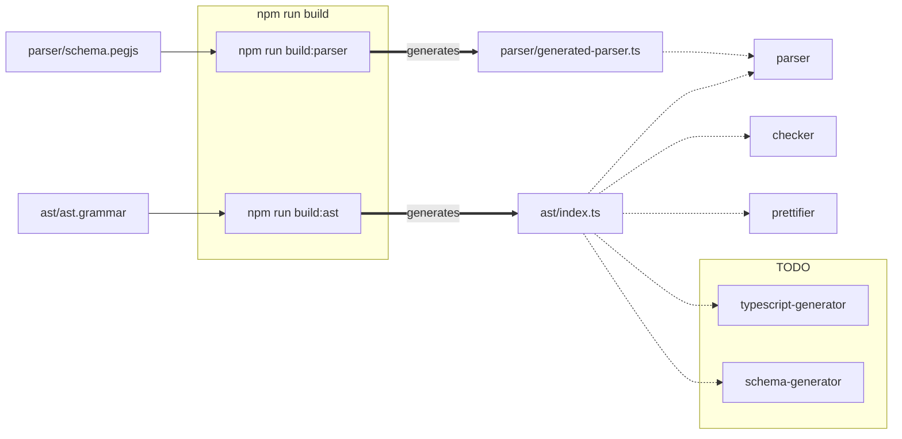

# Liveblocks schema language

This repo is currently private while we're still setting up the foundational
work, but this may eventually become open source.

This monorepo consists of two subprojects:

- [`liveblocks-schema`](./packages/liveblocks-schema) - the source of the main
  `@liveblocks/schema` package
- [`ast-generator`](./packages/ast-generator) - an internal build tool

# Architecture

