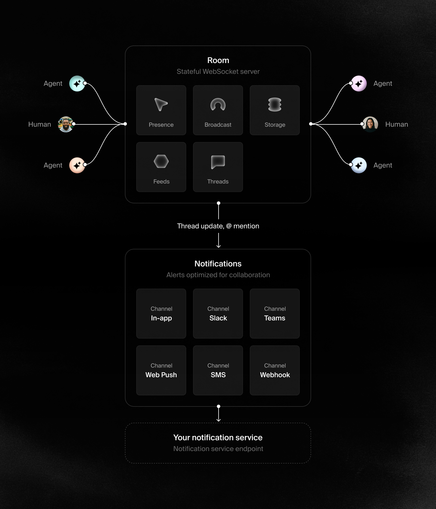

  
  

  
  
    
  

**[Liveblocks](https://liveblocks.io) gives you the building blocks and
infrastructure to enable people and AI to work together inside your app.**

**[Get started for free](https://liveblocks.io/signup)**

## Ready-made features

Liveblocks includes a set of collaboration building blocks you can use
individually or together. These ready-made features provide pre-built
components, hooks, and APIs that handle the complexity of realtime
collaboration, allowing you to focus on building your product’s unique
experience.

- [Comments](https://liveblocks.io/comments) - Add contextual comments directly
  inside your product
- [Multiplayer](https://liveblocks.io/multiplayer) - Add realtime collaboration
  to your product experience
- [AI Agents](https://liveblocks.io/ai-agents) - Add AI collaborators to your
  product
- [Notifications](https://liveblocks.io/notifications) - Add notifications to
  your app to keep users coming back

## SDKs and packages

Packages for specific libraries and frameworks to add Liveblocks-powered
collaborative experiences to your product. Integrations are designed to serve
various collaboration use cases such as collaborative text editors, comments,
notifications, and more.

- [`@liveblocks/client`](https://liveblocks.io/docs/api-reference/liveblocks-client)
- [`@liveblocks/react`](https://liveblocks.io/docs/api-reference/liveblocks-react)
- [`@liveblocks/react-ui`](https://liveblocks.io/docs/api-reference/liveblocks-react-ui)
- [`@liveblocks/react-tiptap`](https://liveblocks.io/docs/api-reference/liveblocks-react-tiptap)
- [`@liveblocks/react-blocknote`](https://liveblocks.io/docs/api-reference/liveblocks-react-blocknote)
- [`@liveblocks/node-prosemirror`](https://liveblocks.io/docs/api-reference/liveblocks-node-prosemirror)
- [`@liveblocks/react-lexical`](https://liveblocks.io/docs/api-reference/liveblocks-react-lexical)
- [`@liveblocks/node-lexical`](https://liveblocks.io/docs/api-reference/liveblocks-node-lexical)
- [`@liveblocks/redux`](https://liveblocks.io/docs/api-reference/liveblocks-redux)
- [`@liveblocks/zustand`](https://liveblocks.io/docs/api-reference/liveblocks-zustand)
- [`@liveblocks/yjs`](https://liveblocks.io/docs/api-reference/liveblocks-yjs)
- [`@liveblocks/node`](https://liveblocks.io/docs/api-reference/liveblocks-node)
- [`@liveblocks/emails`](https://liveblocks.io/docs/api-reference/liveblocks-emails)
- [`@liveblocks/emails`](https://liveblocks.io/docs/api-reference/liveblocks-emails)
- [`REST API`](https://liveblocks.io/docs/api-reference/rest-api-endpoints)

## Developers

- [Documentation](https://liveblocks.io/docs) - [`/docs`](./docs)
- [Guides](https://liveblocks.io/docs/guides) - [`/guides`](./guides)
- [Tutorial](https://liveblocks.io/docs/tutorial/react/getting-started) -
  [`/tutorial`](./tutorial)
- [Examples](https://liveblocks.io/examples) - [`/examples`](./examples)
- [Changelog](https://liveblocks.io/changelog)

## Community and support

- [GitHub issues](https://github.com/liveblocks/liveblocks/issues) to file bugs
  and errors you encounter using Liveblocks.
- [Discord](https://liveblocks.io/discord) to get involved with the Liveblocks
  community, ask questions and share tips.
- [Email](https://liveblocks.io/contact) to contact us directly for support and
  sales enquiries.
- [X](https://x.com/liveblocks) to receive updates, announcements, blog posts,
  and general Liveblocks tips.

## License

Licensed under the Apache License 2.0, Copyright © 2021-present
[Liveblocks](https://liveblocks.io).

See [LICENSE](./LICENSE) for more information.
