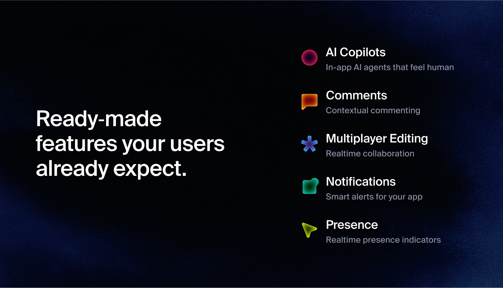

  
  

  
  
    
  

**[Liveblocks](https://liveblocks.io) provides customizable pre-built features
for human and AI collaboration, used to make your product multiplayer, engaging,
and AI‑ready. All without derailing your roadmap.**

**[Get started now](https://liveblocks.io/signup)**

### Ready-made features

Liveblocks provides ready‑to‑use features through customizable pre‑built
components that can easily be dropped into your product to boost growth:
[AI Copilots](https://liveblocks.io/docs/ready-made-features/ai-copilots),
[Comments](https://liveblocks.io/docs/ready-made-features/comments),
[Multiplayer Editing](https://liveblocks.io/docs/ready-made-features/multiplayer-editing),
[Presence](https://liveblocks.io/docs/ready-made-features/presence), and
[Notifications](https://liveblocks.io/docs/ready-made-features/notifications).
You can decide features which you want to use based on your requirements and the
collaborative experiences you’re looking to add.

### Packages and SDKs

Packages for specific libraries and frameworks to add Liveblocks-powered
collaborative experiences to your product. Integrations are designed to serve
various collaboration use cases such as collaborative text editors, comments,
notifications, and more.

- [`@liveblocks/client`](https://liveblocks.io/docs/api-reference/liveblocks-client)
- [`@liveblocks/react`](https://liveblocks.io/docs/api-reference/liveblocks-react)
- [`@liveblocks/react-ui`](https://liveblocks.io/docs/api-reference/liveblocks-react-ui)
- [`@liveblocks/react-tiptap`](https://liveblocks.io/docs/api-reference/liveblocks-react-tiptap)
- [`@liveblocks/react-blocknote`](https://liveblocks.io/docs/api-reference/liveblocks-react-blocknote)
- [`@liveblocks/node-prosemirror`](https://liveblocks.io/docs/api-reference/liveblocks-node-prosemirror)
- [`@liveblocks/react-lexical`](https://liveblocks.io/docs/api-reference/liveblocks-react-lexical)
- [`@liveblocks/node-lexical`](https://liveblocks.io/docs/api-reference/liveblocks-node-lexical)
- [`@liveblocks/redux`](https://liveblocks.io/docs/api-reference/liveblocks-redux)
- [`@liveblocks/zustand`](https://liveblocks.io/docs/api-reference/liveblocks-zustand)
- [`@liveblocks/yjs`](https://liveblocks.io/docs/api-reference/liveblocks-yjs)
- [`@liveblocks/node`](https://liveblocks.io/docs/api-reference/liveblocks-node)
- [`@liveblocks/emails`](https://liveblocks.io/docs/api-reference/liveblocks-emails)

## Developers

- [Documentation](https://liveblocks.io/docs) - [`/docs`](./docs)
- [Guides](https://liveblocks.io/docs/guides) - [`/guides`](./guides)
- [Tutorial](https://liveblocks.io/docs/tutorial/react/getting-started) - [`/tutorial`](./tutorial)
- [Examples](https://liveblocks.io/examples) - [`/examples`](./examples)

You can read our release notes
[here](https://github.com/liveblocks/liveblocks/releases).

## Community and support

- [GitHub issues](https://github.com/liveblocks/liveblocks/issues) to file bugs
  and errors you encounter using Liveblocks.
- [Discord](https://liveblocks.io/discord) to get involved with the Liveblocks
  community, ask questions and share tips.
- [Email](https://liveblocks.io/contact) to contact us directly for support and
  sales enquiries.
- [X](https://x.com/liveblocks) to receive updates, announcements, blog posts,
  and general Liveblocks tips.

## License

Licensed under the Apache License 2.0, Copyright © 2021-present
[Liveblocks](https://liveblocks.io).

See [LICENSE](./LICENSE) for more information.
