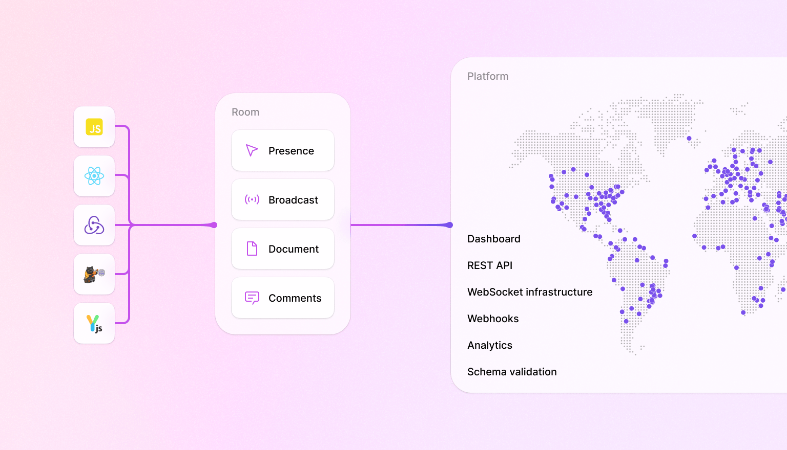

  
  

  
  
    
  

**[Liveblocks](https://liveblocks.io) is a real-time collaboration
infrastructure for building performant collaborative experiences.**

## How Liveblocks works

The foundations of Liveblocks are built upon four core concepts: products,
rooms, integrations, and platform.

### Products

Liveblocks is a fully integrated solution built around core products, each
enabling a different facet of collaborative experiences:
[Presence](https://liveblocks.io/docs/products/presence),
[Broadcast](https://liveblocks.io/docs/products/broadcast),
[Storage](https://liveblocks.io/docs/products/storage), and Comments (private
beta). You can decide what products you want to use based on your requirements
and collaborative experiences you’re looking to build.

### Rooms

A room is the digital space in which people collaborate. You can require your
users to be [authenticated](https://liveblocks.io/docs/rooms/authentication) to
interact with rooms, and each room can have specific
[permissions](https://liveblocks.io/docs/rooms/permissions) and
[metadata](https://liveblocks.io/docs/rooms/metadata) associated with them.

### Integrations

Liveblocks and its community provide integrations that developers can use to
integrate with the Liveblocks products within the rooms. You can use existing
integrations for specific libraries and frameworks, or create a custom one for
your needs.

|                                                                                      | Presence | Broadcast | Storage | Comments |
| ------------------------------------------------------------------------------------ | -------- | --------- | ------- | -------- |
| [`@liveblocks/client`](https://liveblocks.io/docs/api-reference/liveblocks-client)   | ✅       | ✅        | ✅      | ✅       |
| [`@liveblocks/react`](https://liveblocks.io/docs/api-reference/liveblocks-react)     | ✅       | ✅        | ✅      | ✅       |
| [`@liveblocks/redux`](https://liveblocks.io/docs/api-reference/liveblocks-redux)     | ✅       | ❌        | ✅      | ❌       |
| [`@liveblocks/zustand`](https://liveblocks.io/docs/api-reference/liveblocks-zustand) | ✅       | ❌        | ✅      | ❌       |

### Platform

Liveblocks provides a fully-hosted platform built around a WebSocket edge
infrastructure that scales to millions of users. With the platform, you get a
lot of powerful tools such as
[REST APIs](https://liveblocks.io/docs/api-reference/rest-api-endpoints),
[webhooks](https://liveblocks.io/docs/platform/webhooks),
[DevTools](https://liveblocks.io/docs/platform/devtools),
[schema validation](https://liveblocks.io/docs/platform/schema-validation),
analytics, and more.

## Developers

- [Documentation](https://liveblocks.io/docs) - [`/docs`](./docs)
- [Guides](https://liveblocks.io/docs/guides) - [`/guides`](./guides)
- [Tutorial](https://liveblocks.io/docs/tutorial/react/getting-started)
  [`/tutorial`](./tutorial)
- [Examples](https://liveblocks.io/examples) - [`/examples`](./examples)

You can read our release notes
[here](https://github.com/liveblocks/liveblocks/releases).

## Community and support

- [GitHub issues](./issues) to file bugs and errors you encounter using
  Liveblocks.
- [Discord](https://liveblocks.io/discord) to get involved with the Liveblocks
  community, ask questions and share tips.
- [Email](https://liveblocks.io/contact) to contact us directly for support and
  sales enquiries.
- [Twitter](https://twitter.com/liveblocks) to receive updates, announcements,
  blog posts, and general Liveblocks tips.

## License

Licensed under the Apache License 2.0, Copyright © 2021-present
[Liveblocks](https://liveblocks.io).

See [LICENSE](./LICENSE) for more information.
