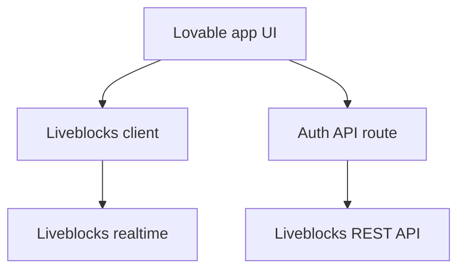

---
meta:
  title: "Lovable + Liveblocks"
  parentTitle: "Integrations"
  description:
    "Add Liveblocks to apps built or exported from Lovable so you can ship
    realtime presence, multiplayer editors, and comments alongside generated UI."
---

[Lovable](https://lovable.dev/) helps you generate full-stack apps quickly. Use
Liveblocks when that product should feel **multiplayer**: shared cursors,
presence, collaborative documents, or [Comments](/docs/collaboration-features/comments).
You integrate Liveblocks the same way as in any React or Next.js codebase: add
the client packages, a server **auth** route for tokens, and wrap your UI in
[`RoomProvider`](/docs/api-reference/liveblocks-react#RoomProvider).

<PromptCta />

## What it enables

- **Realtime UX** on top of Lovable-generated layouts and routes.
- **AI Copilots** and comments patterns from the Liveblocks docs, using your
  existing API routes or serverless handlers from the exported project.

Liveblocks is not a replacement for Lovable’s codegen—it is the collaboration
layer your users connect to in the browser.

## When to use Liveblocks with Lovable

Use it when the generated app is a suitable host (typically React + a backend
for secrets). If the export is static-only, add a small backend (for example
Vercel serverless or your existing API) to mint [access
tokens](/docs/authentication/access-token).

## Recommended architecture



| Piece            | Responsibility                                           |
| ---------------- | -------------------------------------------------------- |
| Lovable / React UI | Components, layout, local state.                     |
| Server route     | `LIVEBLOCKS_SECRET_KEY`, token endpoint, optional webhooks. |
| Liveblocks       | Rooms, Storage, Yjs, Comments, notifications.            |

## Setup

<Steps>
  <Step>
    <StepTitle>Export or sync your project</StepTitle>
    <StepContent>
      Open your Lovable project in the editor you use after export (often VS Code
      or a Git-connected IDE). Ensure you can run `npm install` and a dev server
      locally so you can verify Liveblocks before deploying.
    </StepContent>
  </Step>

  <Step>
    <StepTitle>Add Liveblocks packages</StepTitle>
    <StepContent>
      ```bash
      npm install @liveblocks/client @liveblocks/react
      ```

      Add feature packages as needed, for example `@liveblocks/react-ui` for
      Comments, or `@liveblocks/react-tiptap` for rich text.

      Set your **public** Liveblocks key in client config (`pk_…`) from the
      [dashboard](/dashboard).
    </StepContent>
  </Step>

  <Step>
    <StepTitle>Implement authentication</StepTitle>
    <StepContent>
      Add a server route that calls
      [`Liveblocks.prepareSession`](/docs/api-reference/liveblocks-node#access-tokens)
      or [`Liveblocks.identifyUser`](/docs/api-reference/liveblocks-node#id-tokens)
      with `LIVEBLOCKS_SECRET_KEY`, then returns the token to the client.

      Follow [Access token](/docs/authentication/access-token) for your
      framework (Next.js App Router, Remix, etc.).
    </StepContent>
  </Step>

  <Step lastStep>
    <StepTitle>Wrap collaborative surfaces</StepTitle>
    <StepContent>
      Mount [`RoomProvider`](/docs/api-reference/liveblocks-react#RoomProvider)
      above the part of the tree that should share realtime state. Start from a
      [get started](/docs/get-started) guide that matches your editor (Comments,
      multiplayer Storage, AI Copilots).

      If you add [webhooks](/docs/platform/webhooks) for syncing to a database,
      register the HTTPS URL of your deployed API route in the Liveblocks
      dashboard.
    </StepContent>
  </Step>
</Steps>

## Limitations and troubleshooting

### No server in the export

You need **some** trusted environment for `sk_…`. Pair Lovable’s frontend with
[Vercel](/docs/integrations/vercel) or another host for API routes.

### Auth errors in the browser

Confirm the public key and secret key are from the same Liveblocks project and
that your token route returns a valid token before connecting `RoomProvider`.

### Generated code resets

If Lovable regenerates files, re-apply `RoomProvider` and imports in a stable
wrapper component or route layout you control.

## Related docs

- [AI Copilots](/docs/collaboration-features/ai-copilots)
- [Comments](/docs/collaboration-features/comments)
- [Multiplayer](/docs/collaboration-features/multiplayer)
- [Next.js Starter Kit](/docs/tools/nextjs-starter-kit)
