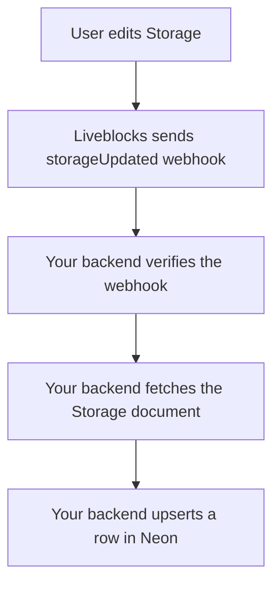
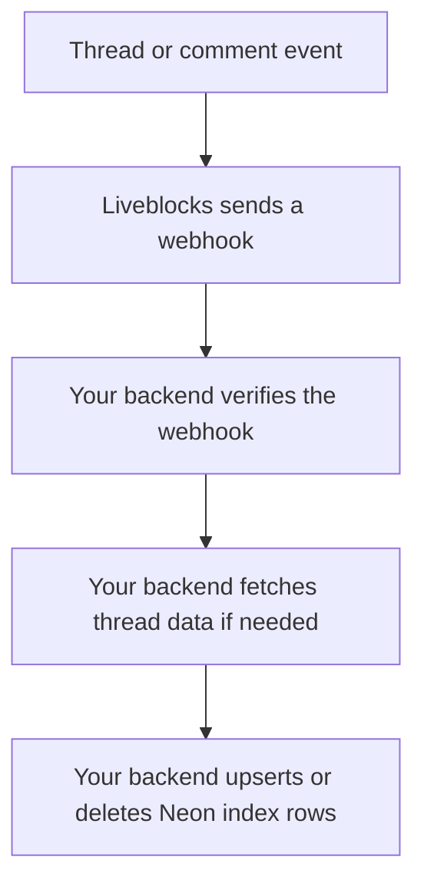

---
meta:
  title: "Neon + Liveblocks"
  parentTitle: "Integrations"
  description:
    "Use Neon with Liveblocks when your collaborative app needs to store data in
    Postgres—for example mirrored collaboration data for reporting, search,
    audit logs, and workflows."
---

Use [Neon](https://neon.tech/) with Liveblocks when your collaborative app needs
to store data in a Postgres database—for example a mirrored copy of Liveblocks
data for reporting, search, audit logs, or app workflows.

Liveblocks is the realtime collaboration layer for
[Storage](/docs/collaboration-features/multiplayer/sync-engine/liveblocks-storage),
[Yjs](/docs/collaboration-features/multiplayer/sync-engine/liveblocks-yjs),
[Comments](/docs/collaboration-features/comments), and
[Threads](/docs/collaboration-features/comments/concepts)—it keeps multiplayer
state in sync between clients. Teams usually treat Postgres as where durable,
queryable app data lives; Neon holds the rows you upsert from your backend when
you mirror collaboration data there.

<PromptCta />

## Recommended architecture

Use [webhooks](/docs/platform/webhooks) to learn when Liveblocks data changes.
Then fetch the latest data with the
[REST API](/docs/api-reference/rest-api-endpoints) and write it to Neon.



| System                | Responsibility                                                               |
| --------------------- | ---------------------------------------------------------------------------- |
| Liveblocks            | Realtime collaboration, rooms, permissions, Storage, Yjs, Comments, Threads. |
| Your backend endpoint | Verify webhooks, fetch Liveblocks data, and write to Neon.                    |
| Neon Postgres         | Store mirrored rows for queries, reports, search, or audits.                 |

## Set up Storage sync

The recommended starting point is mirroring each room's Storage document into a
Neon row. This gives you one clear path before adding Yjs or Comments data.

[`storageUpdated`](/docs/platform/webhooks#StorageUpdatedEvent) (and similar)
webhooks are **throttled**; treat Neon as an **eventually consistent** mirror,
not a live substitute for Liveblocks when the user is editing.

Before starting, create or open a Liveblocks project and a Neon project. You will
need:

- A Liveblocks webhook signing secret.
- A Liveblocks secret key for REST API calls.
- A Neon **connection string** (serverless driver URL recommended), stored as
  `DATABASE_URL` on your backend.

Install the Neon serverless driver in the app that hosts your webhook:

```bash
npm install @neondatabase/serverless
```

<Steps>
  <Step>
    <StepTitle>Create the Neon table</StepTitle>
    <StepContent>
      Create one row per Liveblocks room (run in the Neon SQL editor or a
      migration).

      ```sql
      create table liveblocks_documents (
        room_id text primary key,
        data jsonb not null,
        updated_at timestamptz not null default now()
      );
      ```
    </StepContent>

  </Step>

  <Step>
    <StepTitle>Create a webhook endpoint</StepTitle>
    <StepContent>
      Add a backend endpoint in your app, for example
      `/api/liveblocks-neon-sync`.

      ```ts
      export async function POST(request: Request) {
        const body = await request.json();
        const headers = request.headers;

        // Verify the webhook, then sync to Neon.
        // ...

        return new Response(null, { status: 200 });
      }
      ```
    </StepContent>

  </Step>

  <Step>
    <StepTitle>Subscribe to Storage updates</StepTitle>
    <StepContent>
      In the [Liveblocks dashboard](/dashboard), create a webhook endpoint for
      your backend URL. Subscribe to
      [`storageUpdated`](/docs/platform/webhooks#StorageUpdatedEvent), then copy
      the webhook signing secret.
    </StepContent>

  </Step>

  <Step lastStep>
    <StepTitle>Sync Storage to Neon</StepTitle>
    <StepContent>
      Verify the webhook with
      [`WebhookHandler`](/docs/api-reference/liveblocks-node#WebhookHandler),
      fetch the latest Storage document with
      [Get Storage Document](/docs/api-reference/rest-api-endpoints#get-rooms-roomId-storage),
      then upsert the Neon row with
      [`@neondatabase/serverless`](https://github.com/neondatabase/serverless).

      ```ts
      import { neon } from "@neondatabase/serverless";
      import { WebhookHandler } from "@liveblocks/node";

      const webhookHandler = new WebhookHandler(
        process.env.LIVEBLOCKS_WEBHOOK_SECRET!
      );

      const sql = neon(process.env.DATABASE_URL!);

      export async function POST(request: Request) {
        const body = await request.json();
        const headers = request.headers;

        let event;
        try {
          event = webhookHandler.verifyRequest({
            headers,
            rawBody: JSON.stringify(body),
          });
        } catch {
          return new Response("Could not verify webhook call", { status: 400 });
        }

        if (event.type !== "storageUpdated") {
          return new Response(null, { status: 200 });
        }

        const { roomId } = event.data;

        const response = await fetch(
          `https://api.liveblocks.io/v2/rooms/${roomId}/storage`,
          {
            headers: {
              Authorization: `Bearer ${process.env.LIVEBLOCKS_SECRET_KEY}`,
            },
          }
        );

        if (!response.ok) {
          return new Response("Could not fetch Storage document", {
            status: 500,
          });
        }

        const data = await response.json();

        try {
          await sql`
            insert into liveblocks_documents (room_id, data, updated_at)
            values (${roomId}, ${JSON.stringify(data)}::jsonb, now())
            on conflict (room_id) do update set
              data = excluded.data,
              updated_at = excluded.updated_at
          `;
        } catch {
          return new Response("Could not write to Neon", { status: 500 });
        }

        return new Response(null, { status: 200 });
      }
      ```
    </StepContent>

  </Step>
</Steps>

Use `on conflict` upserts instead of plain inserts because the same room can
update many times.

## Sync Yjs documents

```mermaid
graph TD
  A[Yjs update] --> B[Liveblocks sends ydocUpdated webhook]
  B --> C[Your backend verifies the webhook]
  C --> D[Your backend fetches /rooms/{roomId}/ydoc]
  D --> E[Your backend upserts a row in Neon]
```

For Yjs apps, use the same pattern with the
[`ydocUpdated`](/docs/platform/webhooks#YDocUpdatedEvent) webhook and the
[Get Yjs Document](/docs/api-reference/rest-api-endpoints#get-rooms-roomId-ydoc)
REST API. Store the payload in a `bytea` or `jsonb` column depending on how you
need to query it.

## Sync Comments and Threads



For Comments, mirror only the fields your database workflow needs, such as
`roomId`, `threadId`, `commentId`, resolved state, metadata, timestamps, author
IDs, or a normalized search representation.

Start with these webhook events:

- [`threadCreated`](/docs/platform/webhooks#ThreadCreatedEvent)
- [`threadDeleted`](/docs/platform/webhooks#ThreadDeletedEvent)
- [`threadMetadataUpdated`](/docs/platform/webhooks#ThreadMetadataUpdatedEvent)
- [`commentCreated`](/docs/platform/webhooks#CommentCreatedEvent)
- [`commentEdited`](/docs/platform/webhooks#CommentEditedEvent)
- [`commentDeleted`](/docs/platform/webhooks#CommentDeletedEvent)

Comments and Threads are authored through Liveblocks so realtime collaboration
stays correct. Use Neon as an index for reporting, search, moderation, or audits.

## Limits and troubleshooting

### Storage or Yjs data is stale

[`storageUpdated`](/docs/platform/webhooks#StorageUpdatedEvent) and
[`ydocUpdated`](/docs/platform/webhooks#YDocUpdatedEvent) webhooks are throttled
because collaborative documents can change many times per second. Treat Neon as
an eventually consistent mirror, not as the live editing channel.

### Webhook verification fails

Check that `LIVEBLOCKS_WEBHOOK_SECRET` is the signing secret for the webhook
endpoint that sent the event. Also make sure your endpoint passes the same raw
body string to
[`verifyRequest`](/docs/api-reference/liveblocks-node#verifyRequest) that it
received from Liveblocks.

### Neon writes fail

Keep `DATABASE_URL` on the server only. Use a role with permission to write the
mirror tables. If you use Neon's pooled connection string, follow Neon's
guidance for serverless and long-running workers.

### Duplicate writes happen

Webhook deliveries can be retried. Use upserts with a stable primary key such as
`room_id`, `thread_id`, or `comment_id` so repeated deliveries update the same
row.

### Liveblocks REST requests fail

Check that `LIVEBLOCKS_SECRET_KEY` is a secret key from the same Liveblocks
project as the room. If the request still fails, return a non-2xx response so the
webhook can be retried.

## Related docs

- [Supabase + Liveblocks](/docs/integrations/supabase) (same mirror pattern with
  another Postgres host).
- [Webhooks](/docs/platform/webhooks).
- [REST API reference](/docs/api-reference/rest-api-endpoints).
- [Comments](/docs/collaboration-features/comments).
- [Multiplayer](/docs/collaboration-features/multiplayer).
