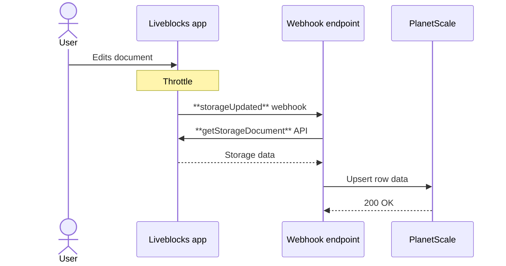

---
meta:
  title: "PlanetScale + Liveblocks"
  parentTitle: "Integrations"
  description:
    "Use PlanetScale with Liveblocks when your collaborative app needs to store
    data in a MySQL database—for example mirrored collaboration data for
    reporting, search, audit logs, and workflows."
---

[PlanetScale](https://planetscale.com/) provides a serverless MySQL database
with horizontal scaling and branching. Using webhooks, you can set up one-way
synchronization of your Liveblocks data to PlanetScale for reporting, search,
audit logs, or app workflows.

<PromptCta />

## How data sync works

Liveblocks [webhooks](/docs/platform/webhooks) trigger when certain events
happen, such as when a collaborative document updates. Liveblocks can trigger an
endpoint in your back end, and from here, you can fetch the latest data and
write it to PlanetScale. Here’s an example of how it works with
[Liveblocks Storage](/docs/collaboration-features/multiplayer/sync-engine/liveblocks-storage).



## Which data can be synced?

Various types of Liveblocks data can be synched to PlanetScale with webhooks.

| Name                     | Description                     | Relevant webhook                                                | Relevant API                                                                         |
| ------------------------ | ------------------------------- | --------------------------------------------------------------- | ------------------------------------------------------------------------------------ |
| Rooms                    | Created rooms and metadata.     | [`roomUpdated`](/docs/platform/webhooks#RoomUpdatedEvent)       | [`getRoom`](/docs/api-reference/liveblocks-node#get-rooms-roomId)                    |
| Active users             | Currently connected users.      | [`userEntered`](/docs/platform/webhooks#UserEnteredEvent)       | [`getActiveUsers`](/docs/api-reference/liveblocks-node#get-active-users)             |
| Liveblocks Storage       | Custom realtime document state. | [`storageUpdated`](/docs/platform/webhooks#StorageUpdatedEvent) | [`getStorageDocument`](/docs/api-reference/liveblocks-node#get-rooms-roomId-storage) |
| React Flow               | Flowchart state.                | [`storageUpdated`](/docs/platform/webhooks#StorageUpdatedEvent) | [`mutateFlow`](/docs/api-reference/liveblocks-react-flow#mutateFlow)                 |
| Yjs                      | `Y.Doc` document state.         | [`ydocUpdated`](/docs/platform/webhooks#YDocUpdatedEvent)       | [`getYjsDocument`](/docs/api-reference/liveblocks-node#get-rooms-roomId-ydoc)        |
| Tiptap/BlockNote/Lexical | Text editor state.              | [`ydocUpdated`](/docs/platform/webhooks#YDocUpdatedEvent)       | [`getYjsDocument`](/docs/api-reference/liveblocks-node#get-rooms-roomId-ydoc)        |
| Threads                  | Comments, reactions, more.      | [`threadCreated`](/docs/platform/webhooks#ThreadCreatedEvent)   | [`getThread`](/docs/api-reference/liveblocks-node#get-rooms-roomId-threads-threadId) |

<Banner title="This is a summary">
  This is not an exhaustive list—around [15 related webhook
  events](/docs/platform/webhooks#Liveblocks-events) are available, along with
  many [Node.js methods](/docs/api-reference/liveblocks-node), [Python
  functions](/docs/api-reference/liveblocks-python), and [REST API
  endpoints](/docs/api-reference/rest-api-endpoints).
</Banner>

## Setup

Quickstart for synching Liveblocks data to PlanetScale. In this example, we
sync Liveblocks Storage data to PlanetScale, but you can use the same pattern
with other APIs and webhooks to sync other types of data.

<Banner title="Step-by-step guide">
  We have a [full step-by-step guide available
  here](/docs/guides/how-to-synchronize-your-liveblocks-storage-document-data-to-a-planetscale-mysql-database),
  this page provides a quick summary.
</Banner>

<Steps>
  <Step>
    <StepTitle>Create the PlanetScale table</StepTitle>
    <StepContent>
      Use one row for each Liveblocks room.

      ```sql
      create table liveblocks_documents (
        room_id varchar(255) primary key,
        data json not null,
        updated_at timestamp not null default current_timestamp
          on update current_timestamp
      );
      ```
    </StepContent>

  </Step>

  <Step>
    <StepTitle>Create a webhook endpoint</StepTitle>
    <StepContent>
      Add a back end endpoint in your app, for example at
      `/api/liveblocks-webhook`.

      ```ts
      export async function POST(request: Request) {
        const body = await request.json();
        const headers = request.headers;

        // Verify the webhook event, then sync to PlanetScale
        // ...

        return new Response(null, { status: 200 });
      }
      ```
    </StepContent>

  </Step>

  <Step>
    <StepTitle>Subscribe to Storage updates</StepTitle>
    <StepContent>
      In the [Liveblocks dashboard](/dashboard), navigate to the “Webhooks’ page inside a project. 
      Create a webhook endpoint for your endpoint URL. Subscribe to
      [`storageUpdated`](/docs/platform/webhooks#StorageUpdatedEvent), then copy
      the webhook secret.
    </StepContent>

  </Step>

    <Step>
    <StepTitle>Verify the webhook event</StepTitle>
    <StepContent>
      In your endpoint, using [`WebhookHandler`](/docs/api-reference/liveblocks-node#WebhookHandler),
      verify the webhook event with the webhook secret from the dashboard.

      ```ts
      import { WebhookHandler } from "@liveblocks/node";

      const webhookHandler = new WebhookHandler(
        process.env.LIVEBLOCKS_WEBHOOK_SECRET!
      );

      export async function POST(request: Request) {
        const body = await request.json();
        const headers = request.headers;

        // Verify if this is a real webhook request
        // +++
        let event;
        try {
          event = webhookHandler.verifyRequest({
            headers: headers,
            rawBody: JSON.stringify(body),
          });
        } catch (err) {
          console.error(err);
          return new Response("Could not verify webhook call", { status: 400 });
        }
        // +++

        // Sync to PlanetScale
        // ...

        return new Response(null, { status: 200 });
      }
      ```
    </StepContent>

  </Step>

  <Step>
    <StepTitle>Sync Storage to PlanetScale</StepTitle>
    <StepContent>
    Set up your Liveblocks and PlanetScale clients, before fetching the Storage document data with
     [`getStorageDocument`](/docs/api-reference/rest-api-endpoints#get-rooms-roomId-storage) and
     upserting the PlanetScale row with `on duplicate key update`.

      ```ts
      import { Liveblocks, WebhookHandler } from "@liveblocks/node";
      import { connect } from "@planetscale/database";

      const liveblocks = new Liveblocks({
        secret: process.env.LIVEBLOCKS_SECRET_KEY!,
      });

      const db = connect({ url: process.env.DATABASE_URL! });

      const webhookHandler = new WebhookHandler(
        process.env.LIVEBLOCKS_WEBHOOK_SECRET!
      );

      export async function POST(request: Request) {
        const body = await request.json();
        const headers = request.headers;

        // Verify if this is a real webhook request
        let event;
        try {
          event = webhookHandler.verifyRequest({
            headers: headers,
            rawBody: JSON.stringify(body),
          });
        } catch (err) {
          console.error(err);
          return new Response("Could not verify webhook call", { status: 400 });
        }

        // +++
        if (event.type === "storageUpdated") {
          const { roomId } = event.data;

          // Get Storage document data
          const data = await liveblocks.getStorageDocument(roomId, "json");

          // Upsert into PlanetScale
          await db.execute(
            `insert into liveblocks_documents (room_id, data)
             values (?, ?)
             on duplicate key update data = values(data)`,
            [roomId, JSON.stringify(data)]
          );
        }
        // +++

        return new Response(null, { status: 200 });
      }
      ```
    </StepContent>

  </Step>

  <Step lastStep>
    <StepTitle>Data sync is set up!</StepTitle>
    <StepContent>
      Your Liveblocks data is now automatically synched to PlanetScale when the webhook event is fired.
    </StepContent>
  </Step>
</Steps>

## Limits and troubleshooting

### Storage or Yjs data is stale

[`storageUpdated`](/docs/platform/webhooks#StorageUpdatedEvent) and
[`ydocUpdated`](/docs/platform/webhooks#YDocUpdatedEvent) webhooks are throttled
because collaborative documents can be modified up to 60 times per second. Treat
PlanetScale as an eventually consistent mirror, not as the live editing channel.

### Webhook verification fails

Check that `LIVEBLOCKS_WEBHOOK_SECRET` is the signing secret for the webhook
endpoint that sent the event. Also make sure your endpoint passes the same raw
body string to
[`verifyRequest`](/docs/api-reference/liveblocks-node#verifyRequest) that it
received from Liveblocks.

### PlanetScale writes fail

Keep `DATABASE_URL` on the server only. Use a database password with permission
to write the mirror tables. PlanetScale doesn’t support foreign keys by
default—if you need referential integrity, model it in application code.

### Duplicate writes happen

Webhook deliveries can be retried. Use `on duplicate key update` upserts with a
stable primary key such as `room_id`, `thread_id`, or `comment_id` so repeated
deliveries update the same row.

### Liveblocks REST requests fail

Check that `LIVEBLOCKS_SECRET_KEY` is a secret key from the same Liveblocks
project as the room. If the request still fails, return a non-2xx response so
the webhook can be retried.

## Related docs

- [Synchronize Liveblocks Storage document data to PlanetScale MySQL](/docs/guides/how-to-synchronize-your-liveblocks-storage-document-data-to-a-planetscale-mysql-database).
- [Synchronize Liveblocks Yjs document data to PlanetScale MySQL](/docs/guides/how-to-synchronize-your-liveblocks-yjs-document-data-to-a-planetscale-mysql-database).
- API references for, [webhooks](/docs/platform/webhooks),
  [Node.js](/docs/api-reference/liveblocks-node),
  [Python](/docs/api-reference/liveblocks-python), and
  [REST API](/docs/api-reference/rest-api-endpoints).
