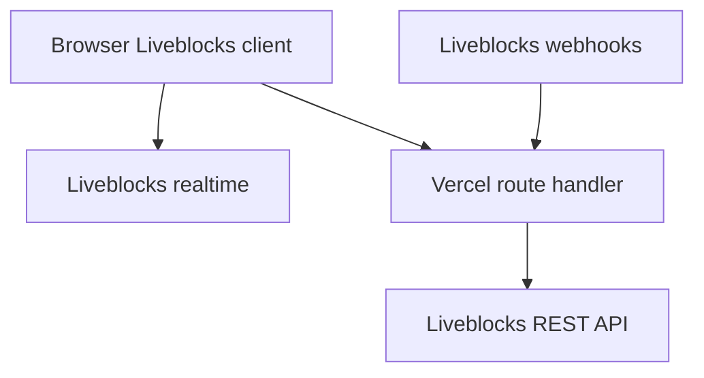

---
meta:
  title: "Vercel + Liveblocks"
  parentTitle: "Integrations"
  description:
    "Deploy Liveblocks apps on Vercel with environment variables, serverless API
    routes for auth and webhooks, and CI/CD from your repository."
---

[Vercel](https://vercel.com/) is a common host for Next.js and other frameworks
that use Liveblocks. Deploy your collaborative app there when you want preview
deployments, serverless API routes for [access
tokens](/docs/authentication/access-token), and HTTPS endpoints for
[webhooks](/docs/platform/webhooks).

<PromptCta />

## What it enables

- **Hosting** for Next.js (App Router or Pages), Remix, SvelteKit, and other
  stacks Vercel supports.
- **Serverless functions** for issuing Liveblocks tokens and receiving webhook
  callbacks from the Liveblocks dashboard.
- **Environment variables** for `LIVEBLOCKS_SECRET_KEY`, webhook secrets, and
  your auth provider keys—without exposing them to the browser.

## When to use Liveblocks with Vercel

Use Vercel when your Liveblocks client runs in the browser and your token
endpoint (or webhook sync worker) should run on demand. Liveblocks still
provides realtime infrastructure; Vercel runs your HTTP surface area.

Routes that use [`@liveblocks/node`](/docs/api-reference/liveblocks-node) (for
example [`WebhookHandler`](/docs/api-reference/liveblocks-node#WebhookHandler) or
token helpers) should use the **Node.js** runtime, not Edge, when those APIs need
Node built-ins.

## Recommended architecture

| Component           | Responsibility                                              |
| ------------------- | ----------------------------------------------------------- |
| Browser             | `@liveblocks/react` (or other SDKs), `RoomProvider`, hooks. |
| Vercel functions    | Auth/token routes, webhook verification, optional DB sync.  |
| Liveblocks          | Rooms, permissions, Storage, Yjs, Comments, webhooks.       |

## Setup

Minimum environment for a typical Next.js app: **`LIVEBLOCKS_SECRET_KEY`**
(`sk_…`, server only) and a way to pass your **public** key (`pk_…`) to
`LiveblocksProvider`—often a `NEXT_PUBLIC_*` variable your starter defines. Add
`LIVEBLOCKS_WEBHOOK_SECRET` when you handle [webhooks](/docs/platform/webhooks).

<Steps>
  <Step>
    <StepTitle>Start from a template or your repo</StepTitle>
    <StepContent>
      Fastest path: use the [Next.js Starter Kit](/docs/tools/nextjs-starter-kit)
      or run `npx create-liveblocks-app@latest --next` locally, then push the
      repo to GitHub (or GitLab/Bitbucket) and import it in Vercel.

      During Starter Kit setup you can choose **Deploy to Vercel** to connect the
      [Vercel Integration](https://vercel.com/integrations) flow.
    </StepContent>
  </Step>

  <Step>
    <StepTitle>Add environment variables</StepTitle>
    <StepContent>
      In the Vercel project **Settings → Environment Variables**, add at least:

      - `LIVEBLOCKS_SECRET_KEY` — secret key (`sk_…`) from the [Liveblocks
        dashboard](/dashboard).
      - Any keys your auth flow needs (OAuth, session secrets, database URLs).

      For [webhooks](/docs/platform/webhooks), add `LIVEBLOCKS_WEBHOOK_SECRET`
      (`whsec_…`) to the same environment and read it only in server code.

      Redeploy after changing variables.
    </StepContent>
  </Step>

  <Step>
    <StepTitle>Expose HTTPS routes</StepTitle>
    <StepContent>
      - **Auth**: keep your `/api/liveblocks-auth` (or equivalent) route as a
        serverless function so the secret key never ships to the client.
      - **Webhooks**: add a route such as `/api/liveblocks-webhook`, return
        non-2xx on failure so Liveblocks can retry, and verify signatures with
        [`WebhookHandler`](/docs/api-reference/liveblocks-node#WebhookHandler).
        Set the route to the **Node.js** runtime if `@liveblocks/node` requires
        it (see [Edge runtime and Node APIs](#edge-runtime-and-node-apis) below).

      Use your production deployment URL when registering webhooks in the
      dashboard. For local testing, see
      [How to test webhooks on localhost](/docs/guides/how-to-test-webhooks-on-localhost).
    </StepContent>
  </Step>

  <Step lastStep>
    <StepTitle>Deploy and verify</StepTitle>
    <StepContent>
      Open the deployed URL, join a room with two browsers, and confirm
      presence or Storage updates. Hit your auth route with the same
      `LIVEBLOCKS_SECRET_KEY` project as the client `publicApiKey`.
    </StepContent>
  </Step>
</Steps>

## Limitations and troubleshooting

### 401 or "Forbidden" from Liveblocks

The **public** key in the client must belong to the same project as
`LIVEBLOCKS_SECRET_KEY` on the server. Regenerate tokens if you rotated keys.

### Webhooks never arrive

Confirm the dashboard endpoint URL matches your Vercel deployment (including
`/api/...` path) and that the function allows `POST`. Check Vercel function logs
for 4xx/5xx.

### Edge runtime and Node APIs

If you use `@liveblocks/node` in a route, ensure the route runs in a **Node.js**
runtime (not Edge) when the package requires Node APIs.

## Related docs

- [Next.js Starter Kit](/docs/tools/nextjs-starter-kit)
- [Authentication](/docs/authentication)
- [Webhooks](/docs/platform/webhooks)
- [REST API reference](/docs/api-reference/rest-api-endpoints)
