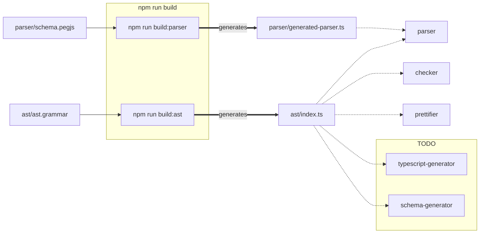

# Tools for schema validation

This repo is currently private while we're still setting up the foundational
work, but this may eventually become open source.

This repo offers:

- A private NPM package, installable via `@liveblocks/schema`

# Architecture



# Trying it locally

Make sure you have direnv installed. `parse-schema` is defined in
`bin/parse-schema`. It's a convenient wrapper that will recompile the parser any
time the parser definition is outdated modified.

```bash
$ parse-schema good.lsl
$ parse-schema bad.lsl
```
