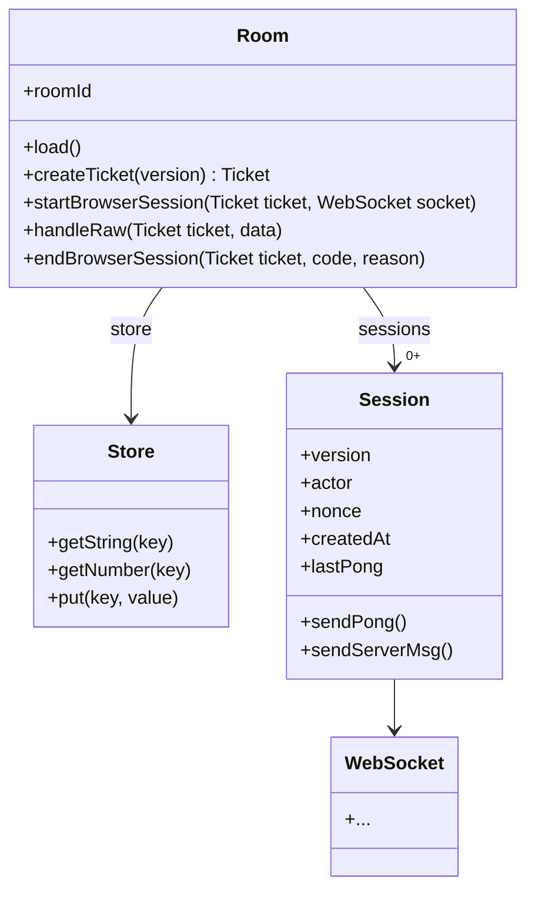

<p align="center">
  <a href="https://liveblocks.io#gh-light-mode-only">
    
  </a>
  <a href="https://liveblocks.io#gh-dark-mode-only">
    
  </a>
</p>

# `@liveblocks/server`

<p>
  <a href="https://npmjs.org/package/@liveblocks/server">
    
  </a>
  <a href="https://bundlephobia.com/package/@liveblocks/server">
    
  </a>
  <a href="https://github.com/liveblocks/liveblocks/blob/main/LICENSE">
    
  </a>
</p>

`@liveblocks/server` provides the APIs to run a Liveblocks server yourself.

## Installation

```
bun install @liveblocks/server
```

## Architecture



## License

Licensed under the GNU Affero General Public License v3.0 or later,
Copyright © 2021-present [Liveblocks](https://liveblocks.io).

See [LICENSE-AGPL-3.0](../../licenses/LICENSE-AGPL-3.0) for more information.
