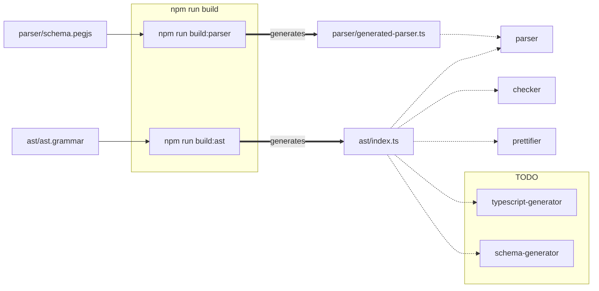

# Liveblocks schema language

This subsection of the repo is where the Liveblocks schema
language is developed and maintained.

- [`liveblocks-schema`](./schema-lang/liveblocks-schema) - the parser and the type checker for the Liveblocks schema language
- [`infer-schema`](./schema-lang/infer-schema) - an experimental library to help generate schema definitions from existing room data
- [`codemirror-language`](./schema-lang/codemirror-language) the definition of the language for use in CodeMirror.

# Architecture

